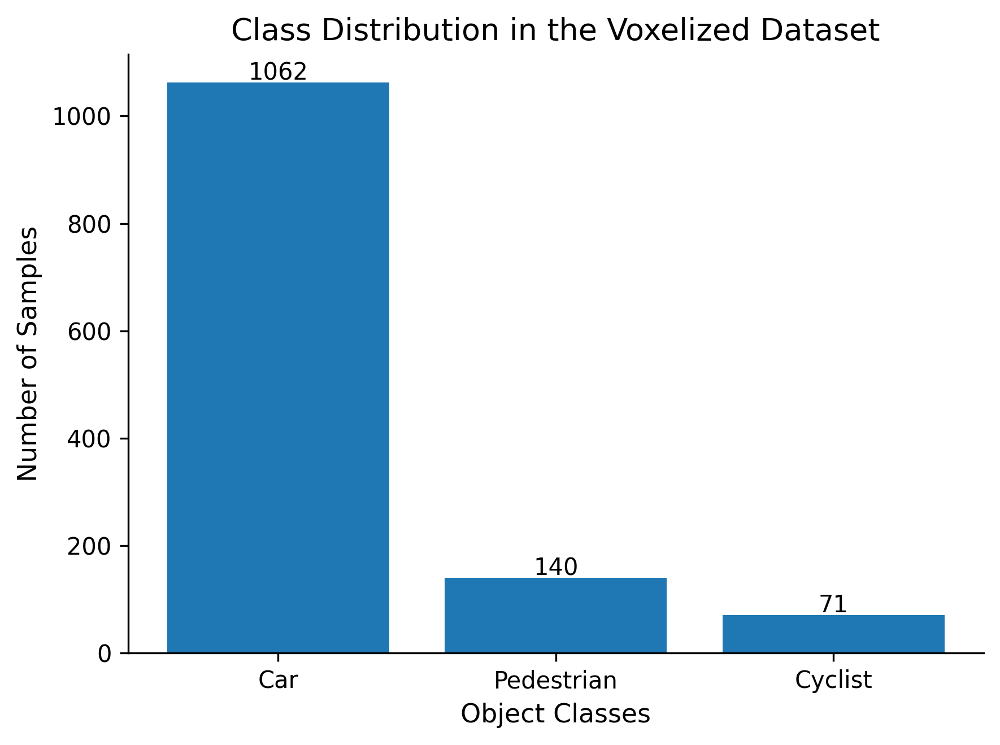

# 🚗 PointCloud-to-Voxel-3DCNN

> **A Deep Learning Pipeline for Voxelizing LiDAR Point Clouds and Classifying 3D Objects using a Custom 3D Convolutional Neural Network (3D CNN).**


---

# 📖 Overview

This repository presents an end-to-end deep learning pipeline for **3D object classification** using LiDAR point cloud data from the **KITTI Vision Benchmark Dataset**.

The proposed framework converts raw LiDAR point clouds into **voxel grid representations**, enabling a lightweight **3D Convolutional Neural Network (3D CNN)** to automatically learn spatial and geometric features for object classification.

Unlike traditional machine learning approaches that rely on handcrafted features, the proposed model performs **automatic feature learning** directly from voxelized point clouds.

This project was developed as part of my **Master's Thesis in Artificial Intelligence** at **BTU Cottbus–Senftenberg, Germany**.

---

# 🖼 Proposed Pipeline

<p align="center">

</p>

<p align="center">
<b>Figure 1.</b> Proposed end-to-end pipeline for LiDAR point cloud preprocessing, voxelization, feature extraction using a custom 3D CNN, and final object classification.
</p>

---

# 🎯 Research Objective

The objective of this research is to investigate the effectiveness of **voxel-based deep learning** for LiDAR point cloud classification.

The proposed framework focuses on:

* Converting raw LiDAR point clouds into voxel grids.
* Learning spatial and geometric features automatically.
* Classifying three object categories:

  * 🚗 Car
  * 🚶 Pedestrian
  * 🚴 Cyclist
* Evaluating the performance of a lightweight custom 3D CNN architecture.

---

# 🔬 Methodology

The complete workflow consists of the following stages.

```text
Raw LiDAR Point Cloud
        │
        ▼
Camera Calibration
        │
        ▼
3D Bounding Box Cropping
        │
        ▼
Point Cloud Preprocessing
        │
        ▼
Voxelization
        │
        ▼
Binary Occupancy Encoding
        │
        ▼
3D CNN Feature Learning
        │
        ▼
Fully Connected Layers
        │
        ▼
Final Classification
```

---

# 🧠 Deep Learning Architecture

The proposed 3D CNN consists of:

* 3D Convolution Layers
* Batch Normalization
* ReLU Activation
* Max Pooling
* Fully Connected Layers
* Dropout (0.3)
* Softmax Classification

---

# ⚙️ Technologies Used

* Python
* PyTorch
* NumPy
* Open3D
* OpenCV
* Matplotlib
* KITTI Vision Benchmark Dataset

---

# 📊 Training Configuration

| Parameter           | Value              |
| ------------------- | ------------------ |
| Optimizer           | Adam               |
| Learning Rate       | 0.001              |
| Loss Function       | Cross Entropy Loss |
| Batch Size          | 16                 |
| Activation Function | ReLU               |
| Normalization       | BatchNorm3D        |
| Dropout             | 0.3                |

---

# 📈 Training Performance

<p align="center">

</p>

<p align="center">
<b>Figure 2.</b> Training and validation accuracy over epochs.
</p>

---

# 📉 Loss Curve

<p align="center">

</p>

<p align="center">
<b>Figure 3.</b> Training and validation loss during model training.
</p>

---

# 🎯 Confusion Matrix

<p align="center">

</p>

<p align="center">
<b>Figure 4.</b> Confusion matrix for Car, Pedestrian, and Cyclist classification.
</p>

---

# 📊 Dataset Distribution

<p align="center">

</p>

<p align="center">
<b>Figure 5.</b> Distribution of object classes in the training dataset.
</p>

---

# 📋 Evaluation Metrics

<p align="center">

</p>

---

# 📂 Repository Structure

```text
PointCloud-to-Voxel-3DCNN
│
├── levelone/
│   ├── KittiDataset/
│   │   ├── images/
│   │   ├── models/
│   │   ├── results/
│   │   └── scripts/
│   │       ├── 1_read_labels_and_crop_objects.py
│   │       ├── 2_visualize_pointcloud.py
│   │       ├── 3_voxelize.py
│   │       ├── 4_train_3dcnn.py
│   │       └── 5_save_results.py
│   │
│   └── Additional Experiments
│
├── LightFieldGrid/
├── README.md
└── .gitignore
```

---

# ⭐ Key Contributions

* End-to-end LiDAR preprocessing pipeline.
* Camera calibration and coordinate transformation.
* Object extraction using KITTI annotations.
* Binary occupancy voxelization.
* Lightweight custom 3D CNN architecture.
* Automatic feature learning.
* Multi-class object classification.

---

# 🚀 Future Work

Future work may include:

* PointNet
* PointNet++
* Point Transformer
* Sparse Convolution Networks
* SECOND
* VoxelNet
* Voxel R-CNN
* Real-time 3D Object Detection

---

# 💻 Installation

Clone the repository

```bash
git clone https://github.com/Madihaa-Shaikh/PointCloud-to-Voxel-3DCNN.git
```

Move into the project directory

```bash
cd PointCloud-to-Voxel-3DCNN
```

Install the required packages

```bash
pip install -r requirements.txt
```

---

# ▶️ How to Run

### Step 1 – Extract Objects

```bash
python levelone/KittiDataset/scripts/1_read_labels_and_crop_objects.py
```

### Step 2 – Visualize Point Clouds

```bash
python levelone/KittiDataset/scripts/2_visualize_pointcloud.py
```

### Step 3 – Voxelization

```bash
python levelone/KittiDataset/scripts/3_voxelize.py
```

### Step 4 – Train the 3D CNN

```bash
python levelone/KittiDataset/scripts/4_train_3dcnn.py
```

### Step 5 – Save Results

```bash
python levelone/KittiDataset/scripts/5_save_results.py
```

---

# 📚 Dataset

This project uses the **KITTI Vision Benchmark Suite**.

Official Website:

https://www.cvlibs.net/datasets/kitti/

---

# 👩‍💻 Author

**Madiha Shaikh**

Master's in Artificial Intelligence

BTU Cottbus–Senftenberg, Germany

GitHub: https://github.com/Madihaa-Shaikh

---

# 📄 License

This repository is intended for **academic and research purposes**.
