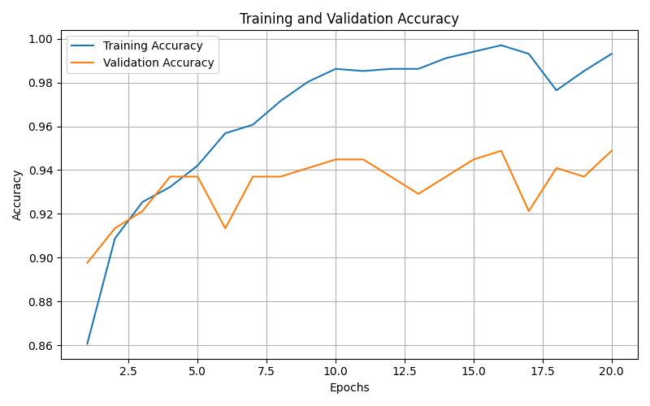
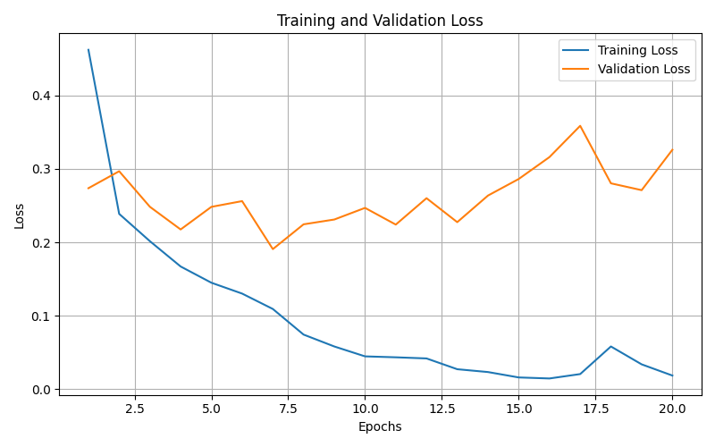
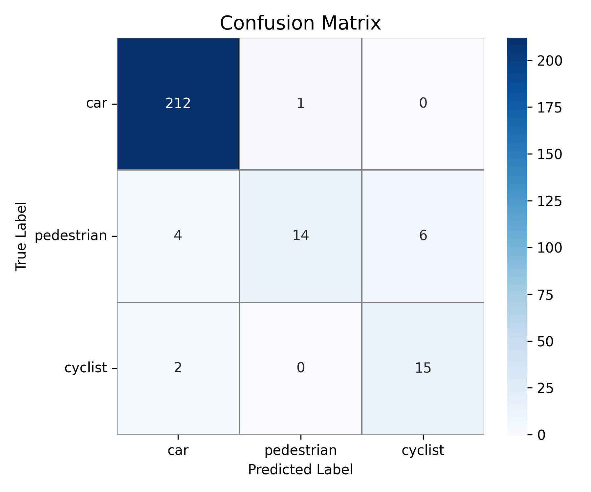
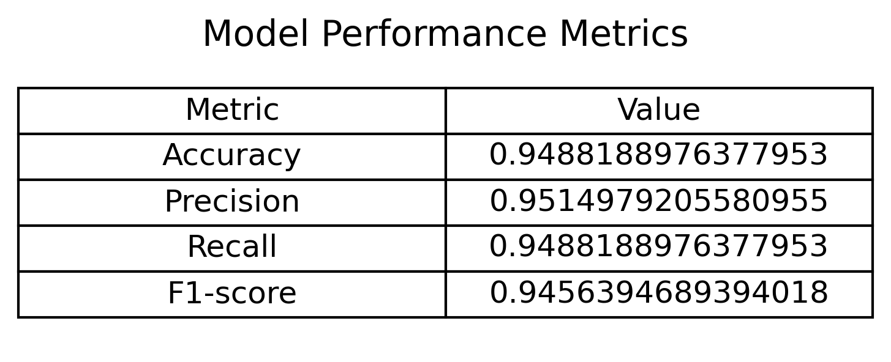

## 🖼️ Project Images and Results

### Proposed Pipeline

  

<b>Figure 1.</b> Proposed RGB–LiDAR point cloud to voxel grid and 3D CNN classification pipeline.

---

### Accuracy Curve

  

---

### Loss Curve

  

---

### Confusion Matrix

  

---

### Evaluation Metrics

  

